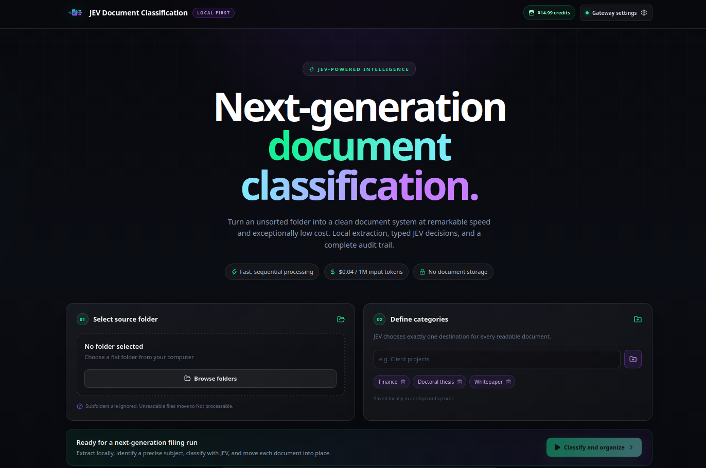

# JEV Document Classification

---

JEV Document Classification sorts documents from a selected folder into category subfolders.  
It uses `typesafe-ai/jev`, an evaluation model from the `typesafe-ai` team, through Vercel AI Gateway.  
JEV returns fast, typed classification decisions at very low cost.  
Choose a folder and add the destination categories in the application.  
The application extracts readable text from supported files before asking JEV to classify them.  
JEV is not multimodal and cannot interpret images or other visual content.  
Unsupported files and documents without extractable text go into a `Not processable` folder.  
Readable documents move into subfolders matching the configured categories.  
Each result includes a primary language and a precise subject, alongside its category.  
Runs report processing time, input tokens, and estimated API cost.  
Configure a Vercel AI Gateway key in the application to start classifying.

---

## See JEV Document Classification in action




---

## Quickstart

### Install

```bash
npm install
```

### Run

```bash
npm run dev
```

Open `http://localhost:5173`, enter a Vercel AI Gateway API key, choose a folder, and start classification. The application creates `config/config.toml` when it is missing.
