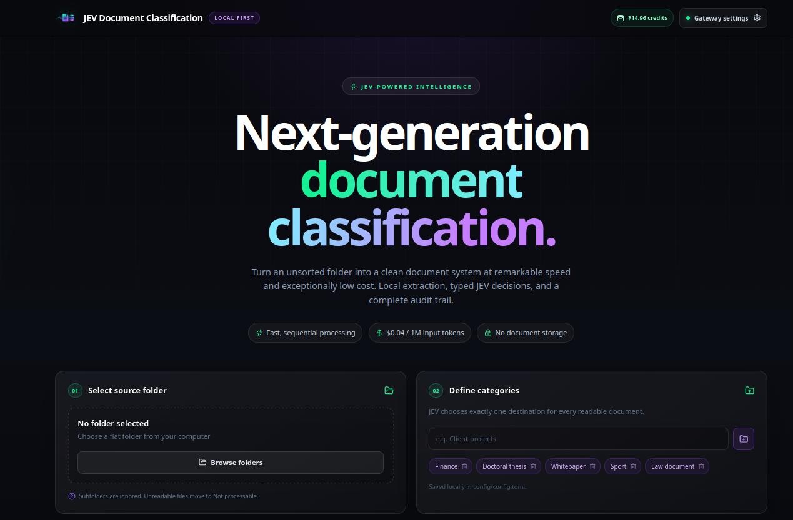
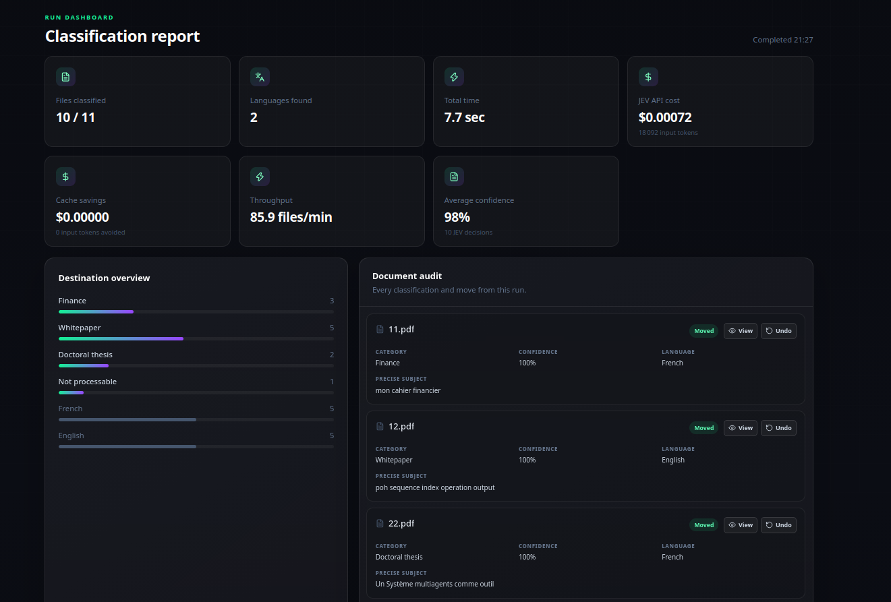

# JEV Document Classification

---

JEV Document Classification sorts documents from a selected folder into category subfolders.  
It uses `typesafe-ai/jev`, an evaluation model from the `typesafe-ai` team, through Vercel AI Gateway.  
JEV returns fast, typed classification decisions at very low cost.  
Choose a folder and add the destination categories in the application.  
The application extracts readable text from supported files before asking JEV to classify them.  
JEV is not multimodal and cannot interpret images or other visual content.  
Unsupported files and documents without extractable text go into a `Not processable` folder.  
Readable documents move into subfolders matching the configured categories.  
Each result includes a primary language and a precise subject, alongside its category.  
The audit also shows JEV's category confidence. Documents below 75% confidence move to `Need review`, while retaining JEV's suggested category for review.
The audit can preview a moved PDF, readable document, or common image in the browser, and restore an individual file to the source folder.
Runs report processing time, input tokens, and estimated API cost.  
Configure a Vercel AI Gateway key in the application to start classifying.

---

## See JEV Document Classification in action





---

## Getting your Vercel AI Gateway API key

To use JEV, you need a Vercel account and an AI Gateway API key.

1. Create a Vercel account or sign in at [Vercel](https://vercel.com).
2. Open the [JEV model page on Vercel AI Gateway](https://vercel.com/ai-gateway/models/jev).
3. Follow the instructions to enable AI Gateway and create an API key.
4. Copy your API key and add it to the application configuration.
5. Start the classification process.

The API key is used to authenticate requests to JEV through Vercel AI Gateway.

---

## Quickstart

### Install

```bash
npm install
```

### Run

```bash
npm run dev
```

Open `http://localhost:5173`, enter a Vercel AI Gateway API key, choose a folder, and start classification. The application creates `config/config.toml` when it is missing.

## Confidence and review queue

JEV supplies a probability for its selected category when the provider returns one. The application sends a document to `Need review` when that probability is below `0.75`. The audit records both the actual destination and the category JEV originally suggested, so a reviewer can quickly decide where it belongs.

If a probability is unavailable, the audit displays `Unavailable` and the document is filed in JEV's selected category. `Need review` and `Not processable` are reserved folder names and cannot be added as regular categories.

## Preview and undo

Each moved file has a **View** action in the run audit. PDFs render directly in the browser; DOCX and supported text documents render their extracted text; PNG, JPEG, GIF, and WebP images render as images. The preview is local to the selected folder session.

The **Undo** action restores that file to the selected root folder. If another file already uses the original name, the restored file receives a numbered name such as `report (1).pdf`; no file is overwritten.

## Faster, lower-cost classification

Each document is reduced locally to a structured profile before JEV receives it. For long documents, the profile is capped at 4,500 characters and includes likely headings, locally extracted subject candidates, and representative excerpts from the beginning, middle, and end. Short documents keep their full text when that is already smaller than the profile limit. The original document text never leaves the local application beyond this bounded context.

Category, primary language, and precise subject already use one typed JEV evaluation request per document. The application processes up to 16 documents concurrently, so independent Vercel AI Gateway calls overlap while each document still moves only after its own request succeeds.

### Compare the compact profile with the former full-text context

Run the benchmark against a copy of a representative source folder before a classification run:

```bash
npm run benchmark:classification -- /absolute/path/to/folder
```

It processes up to ten readable root-level documents without moving them. Each document is sent once with the structured profile and once with the former 24,000-character context. The JSON report contains each pair of decisions, category/language/subject agreement, actual input tokens, actual estimated cost, and aggregate token and cost reduction. Agreement measures whether the two contexts reach the same decision; use documents with known expected categories if you need an accuracy measure against ground truth.
