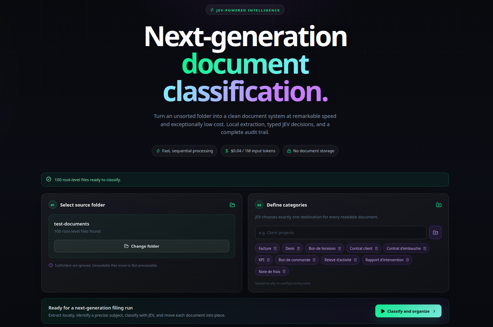
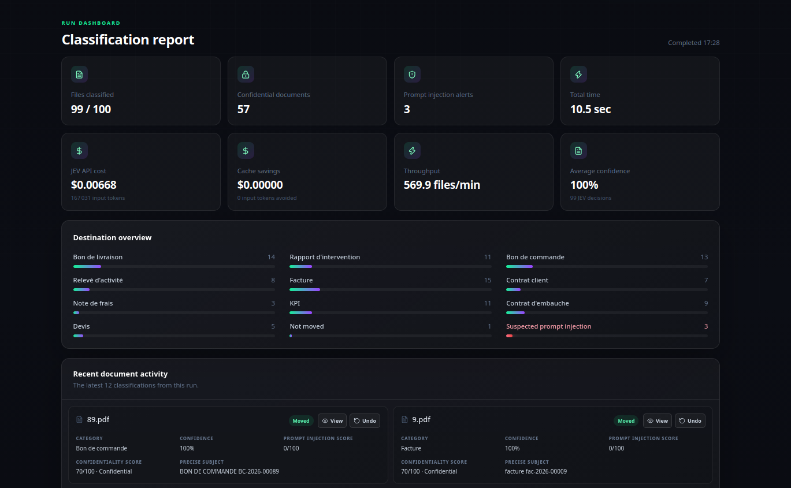
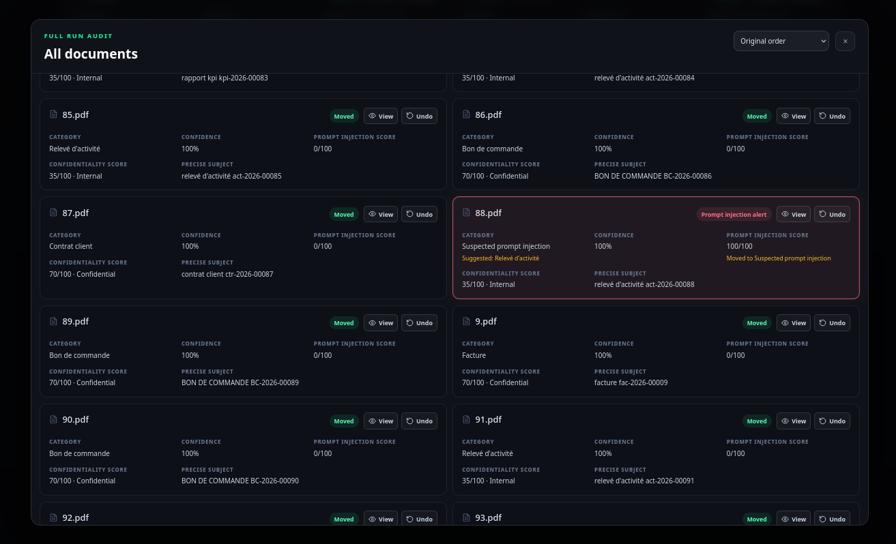

# JEV Document Classification

---

JEV Document Classification is a local-first application that files root-level documents into configured category folders. It extracts readable text locally, then uses `typesafe-ai/jev` through Vercel AI Gateway for typed category, confidentiality, prompt-injection-risk, and subject decisions.

Unsupported, unreadable, and empty documents go to `Not processable`. Low-confidence category decisions go to `Need review`, and suspicious prompt-injection scores go to `Suspected prompt injection`. Files are never overwritten; the audit supports preview and undo. Runs report duration, input tokens, and estimated cost.

---

## See JEV Document Classification in action







---

## Getting your Vercel AI Gateway API key

To use JEV, you need a Vercel account and an AI Gateway API key.

1. Create a Vercel account or sign in at [Vercel](https://vercel.com).
2. Open the [JEV model page on Vercel AI Gateway](https://vercel.com/ai-gateway/models/jev).
3. Follow the instructions to enable AI Gateway and create an API key.
4. Copy your API key and add it to the application configuration.
5. Start the classification process.

The API key is used to authenticate requests to JEV through Vercel AI Gateway.

---

## Quickstart

### Install

```bash
npm install
```

### Run

```bash
npm run dev
```

Open `http://localhost:5173`, enter a Vercel AI Gateway API key, choose a folder, and start classification. The application creates `config/config.toml` when it is missing. You may optionally save an absolute default source-folder path in Gateway settings; the local server will reopen it automatically.

## Classification behavior

JEV supplies a probability for its selected category when the provider returns one. The application sends a document to `Need review` when that probability is below `0.75`. The audit records both the actual destination and the category JEV originally suggested, so a reviewer can quickly decide where it belongs.

If a probability is unavailable, the audit displays `Unavailable` and the document is filed in JEV's selected category. `Need review`, `Not processable`, and `Suspected prompt injection` are reserved folder names.

## Preview and undo

Each moved file has a **View** action in the run audit. PDFs render directly in the browser; DOCX and supported text documents render their extracted text; PNG, JPEG, GIF, and WebP images render as images. The preview is local to the selected folder session.

The **Undo** action restores that file to the selected root folder. If another file already uses the original name, the restored file receives a numbered name such as `report (1).pdf`; no file is overwritten.

## Efficient classification

Each document is reduced locally to a structured profile before JEV receives it. For long documents, the profile is capped at 4,500 characters and includes likely headings, locally extracted subject candidates, and representative excerpts from the beginning, middle, and end. Short documents keep their full text when that is already smaller than the profile limit. The original document text never leaves the local application beyond this bounded context.

Each document uses typed JEV choices for category, confidentiality, prompt injection score, and subject. Very short documents are intelligently grouped into a shared JEV evaluation request (up to 8 documents and 4,500 context characters); larger documents remain individual requests. Every file moves only after its own successful decision.
