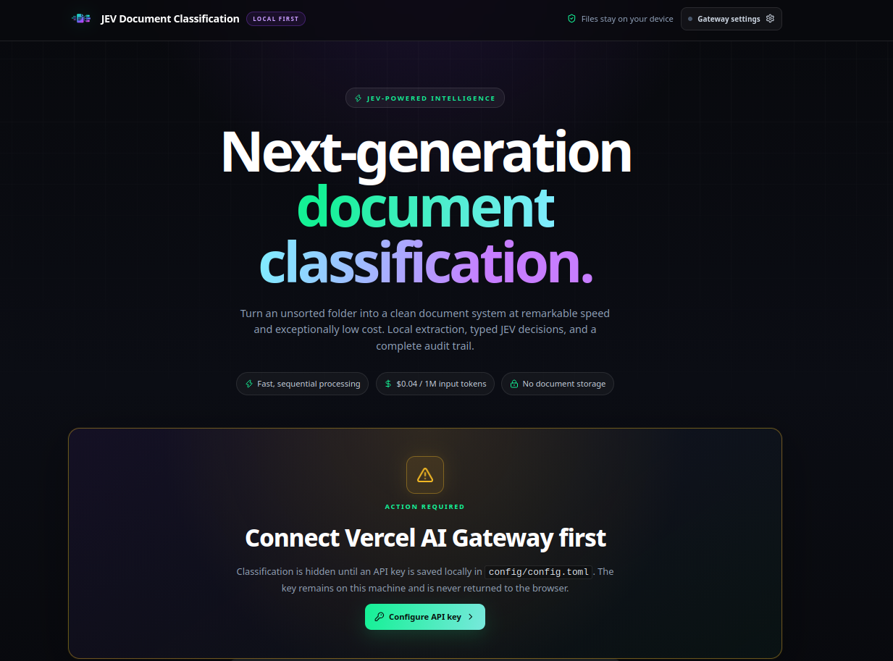
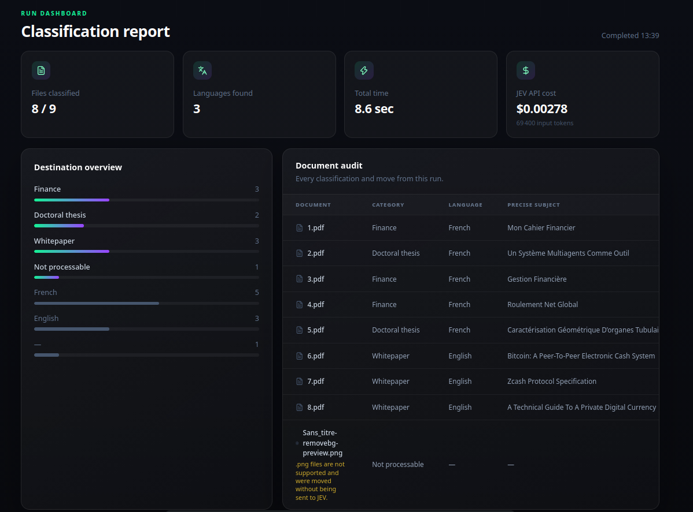

# JEV Document Classification

---

JEV Document Classification organizes a flat local folder into meaningful destinations.

It extracts readable text from supported document formats directly on the user's machine.

JEV assigns one configured category, a primary language, and a document-specific subject.

The application is not multimodal: it processes readable text rather than images or other visual content.

Files with unsupported, unsuitable, unreadable, or empty formats — such as image files — are automatically moved into a default **Not processable** folder.

Readable documents are moved only after both text extraction and classification have successfully completed.

Using JEV requires a Vercel account and an API credential created through the **Vercel AI Gateway**. This credential must be entered into the application to enable document classification.

The Vercel AI Gateway credential is stored on the local server and is never returned to the browser.

Categories and the Vercel AI Gateway credential are managed through the local application interface.

The application can select local folders and organize their contents directly from the user's machine.

Each run reports the classification decisions, processing duration, input token usage, and estimated API cost.

JEV is designed for fast, low-cost, local-first document classification while keeping document processing and API credentials under the user's control.

---

## See T.A.R.S. in action





---

## Quickstart

### Install

```bash
npm install
```

### Run

```bash
npm run dev
```

Open `http://localhost:5173`, enter an AI Gateway API key in the interface, choose a folder, and start the classification run. The application creates `config/config.toml` automatically when it is missing.
